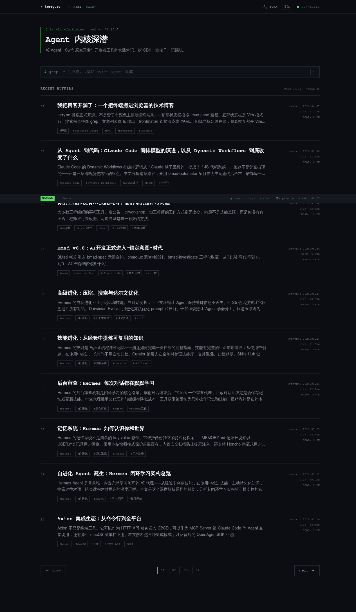

# terry.so — an AI-indexed developer blog

[中文版](./README-zh.md)



A terminal-style personal tech blog built end-to-end on [Lovable](https://lovable.dev), with a lightweight RAG pipeline baked in: every post gets an AI-generated TL;DR, three semantically-related posts, and the homepage answers natural-language queries.

> Live: <https://blog.suchuanyi.dev>
> Lovable preview: <https://hack-buffer.lovable.app>

---

## ✨ Highlights

### UI — terminal-style, content-first
- Monospaced typography, dark background, blinking caret — feels like reading from a terminal, but laid out for long-form Chinese tech writing.
- Built with **Tailwind CSS v4** + **shadcn/ui** + semantic design tokens (`oklch` in `src/styles.css`). Zero ad-hoc colors in components.
- Posts are plain Markdown in `content/posts/`, rendered with `react-markdown` + `rehype-highlight` for syntax-highlighted code blocks.
- Sub-100KB above-the-fold, SSR via TanStack Start, proper canonical / OG / JSON-LD on every route.

### AI — three features, one pipeline, zero API keys
All powered by the **Lovable AI Gateway** (no OpenAI/Gemini keys in the project):

1. **TL;DR for every post** — a 3-sentence Chinese summary generated by `google/gemini-3-flash-preview`, shown above the article body.
2. **Semantically related posts** — embeddings via `google/gemini-embedding-001` (1536-dim), stored in `pgvector`, queried with a `match_posts` RPC using cosine similarity. Three best matches surface under each post.
3. **Natural-language homepage search** — type "如何用 Swift 写 AI Agent" and the homepage returns the most relevant posts by meaning, not keywords.

### Incremental sync — content-hash gated
The indexing pipeline only re-embeds posts whose content actually changed:
- Each post gets a `cyrb53` fingerprint over `title + description + body`.
- A single `POST /api/public/sync-posts` endpoint walks all posts, upserts new/changed ones, deletes removed ones, and returns `{ updated, deleted, failed, upToDate }`.
- A local script (`./scripts/sync-posts.sh`) triggers it after you push markdown to GitHub. No CI, no glue code.

---

## 🧱 Tech stack

| Layer | Tool |
|---|---|
| Framework | TanStack Start (React 19, SSR, file-based routing) |
| Build | Vite 7 |
| Styling | Tailwind v4 + shadcn/ui |
| Backend | Lovable Cloud (Supabase) — Postgres + pgvector + RLS |
| AI | Lovable AI Gateway — Gemini embeddings + Gemini Flash for TL;DR |
| Deploy | Cloudflare Workers (via Lovable publish) |
| Content | Markdown in `content/posts/`, parsed with `gray-matter` |

---

## 🗂 Repo layout

```
content/posts/              Markdown source for every blog post
src/routes/                 File-based routes (TanStack Router)
  index.tsx                 Homepage + semantic search
  posts.$slug.tsx           Post page (TL;DR + related)
  api/public/sync-posts.ts  Public sync endpoint
src/lib/posts-ai.functions.ts  Server functions: embed, TL;DR, search, sync
src/components/PostAiPanels.tsx  TL;DR + related-posts UI
src/components/SearchBox.tsx     Homepage natural-language search
supabase/migrations/        pgvector schema, match_posts RPC, RLS
scripts/sync-posts.sh       Local trigger for the sync endpoint
```

---

## 🚀 Local development

```bash
bun install
cp .env.example .env   # fill in your own values — see Env vars below
bun dev
```

After editing or adding a post, push to GitHub then run:

```bash
export SYNC_SECRET=<the same secret you stored in Lovable / your host>
./scripts/sync-posts.sh        # hits the dev preview URL
./scripts/sync-posts.sh prod   # hits production (after a Lovable publish)
```

The endpoint is idempotent — unchanged posts cost nothing.

> **Forking?** The `dev` / `prod` URLs in `scripts/sync-posts.sh` are hard-coded to this project. Edit the script to point at your own Lovable project ID and your own production domain.

### Env vars

| Var | Where | Purpose |
|---|---|---|
| `VITE_SUPABASE_URL` / `VITE_SUPABASE_PUBLISHABLE_KEY` / `VITE_SUPABASE_PROJECT_ID` | client + server | Auto-injected by Lovable Cloud; required for AI features |
| `SUPABASE_SERVICE_ROLE_KEY` | server only | Used by `/api/public/sync-posts` to upsert embeddings |
| `LOVABLE_API_KEY` | server only | Auth for Lovable AI Gateway (embeddings + TL;DR) |
| `SYNC_SECRET` | server + your terminal | Bearer token for `/api/public/sync-posts`. Generate: `openssl rand -hex 32` |
| `VITE_ENABLE_AI` | client + server | Master switch for AI features (default `true`) |

On Lovable, set `LOVABLE_API_KEY` and `SYNC_SECRET` via the **Secrets** panel; the Supabase vars are managed for you.

### Run as a pure static blog (no AI, no server)

The AI features (TL;DR, related posts, semantic search, `/api/public/sync-posts`) are gated behind a single env var. To strip everything server-side and run as a classic static blog:

```bash
# .env
VITE_ENABLE_AI=false
```

With this flag off:
- `SearchBox` and `PostAiPanels` don't render — no server function calls
- `/api/public/sync-posts` returns `503`
- No `LOVABLE_API_KEY` or Lovable Cloud / Supabase runtime calls needed

Default is **on** (`VITE_ENABLE_AI` unset or `"true"`), matching the live deployment.

---

## 🍴 Make it your own

1. **Fork** this repo → <https://github.com/terryso/hack-buffer/fork>
2. **Open in Lovable** — import the fork. Lovable Cloud provisions a fresh Supabase project + AI gateway key automatically.
3. **Replace content** in `content/posts/` with your own markdown (frontmatter: `title`, `date`, `description`, `tags`).
4. **Rebrand** — edit:
   - `src/routes/__root.tsx` — site title, description, OG image, JSON-LD
   - `src/routes/about.tsx` — bio + links
   - `src/components/SiteShell.tsx` — top-left wordmark (`terry.so`)
   - `src/styles.css` — `oklch` color tokens
   - `public/favicon.svg`, `public/robots.txt`, `public/llms.txt`
5. **Update `scripts/sync-posts.sh`** with your Lovable project ID + production domain.
6. **Generate `SYNC_SECRET`** (`openssl rand -hex 32`), store it in Lovable Secrets.
7. **Publish on Lovable** (or self-host — it's plain TanStack Start, deploys to Cloudflare Workers / any Node host). Then run `./scripts/sync-posts.sh prod` to index your posts.


---


## 🤝 Built with Lovable

This entire project — UI, server functions, database schema, RAG pipeline, deploy — was built through chat on Lovable. The two-way GitHub sync means you can edit locally too; changes flow both ways in real time.

If you want to fork the idea: open it in Lovable, swap `content/posts/` for your own markdown, and the AI features just work.

---

## 📄 License

MIT
